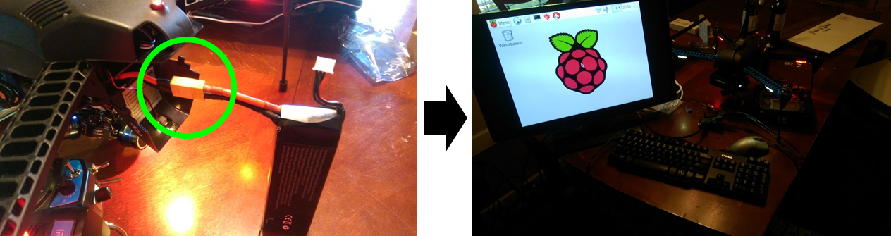

# Aerial Mapping System
This repository contains the software for a turnkey aerial mapping system for urban environments presented by Nicholas Selby, Preston Culbertson, David Steinhoff, and Santiago Vivanco for the 2016 Georgia Institute of Technology Senior Design Expo.

## Part 1: Area Selection
Completing this step results in a single file containing a latitude-longitude grid of all the points the drone will need to capture in order to image the area.

1. Open Full_UI/UI.html in a browser. Enter in the photography specifications and click "Begin Path Planner."

2. Click OK to begin drawing the bounding polygon.

3. Click the mouse on the map to draw a polygon around the area the drone will survey.

4. Click OK to set the home point.

5. Click the point on the map to where the drone should return to recharge between flights.

6. Click "Download CSV" to download a file of latitude-longitude pairs to which the drone will fly.

## Part 2: Path Planning
This system does not assume the drone will have enough battery power to capture every waypoint on a single charge. Thus, this step employs a heuristic solution to the distance constrained [vehicle routing problem](https://en.wikipedia.org/wiki/Vehicle_routing_problem) to divide the waypoints into multiple flights and select an optimal path for each flight. The result is a collection of CSV files, each containing ordered latitude-longitude pairs for a flight that starts and ends at the home point, selected in Part 1 above.

7. Open MATLAB to the Path_Planning directory.
8. Copy the CSV output of the UI above into the Path_Planning directory as "waypoints.csv".
9. Call the getPath function from the Command Window. As outlined in the help documentation, the first input is the total distance the drone can travel on one charge in units of Earth radians. Feel free to change this to a more useful unit using the Haversine formula. We did not do enough testing for this to matter, so we just played it safe by setting the "wallet" arbitrarily low. The second input doesn’t matter. Think of it like a debugging mode to see what's going on behind the scenes.
10. Notice the generated flight##.csv files. These are individual flights that begin and end a the home point specified in Part 1. You can check these files using wpTest.m.

## Part 3: Drone Preparation
This section documents how to upload the requisite files to the Raspberry Pi controlling the drone.

11. Plug mouse and keyboard into Raspberry Pi USB ports and monitor into Raspberry Pi HDMI port.

12. Plug in battery pack to turn on system. Also plug in and turn on monitor.

13. Upload the files Drone_Software/main.py and Path_Planning/flight01.csv (generated in Part 2) to the Raspberry Pi.

## Part 4: Battery Charging
Make sure you have the following supplies:

14. Plug the power supply into the wall via the cable to wall outlet and plug the Multi Charger into the power supply. Turn the power supply on.

15. Follow the manual to set the settings on each Multi Charger screen to LiPo, 2.0A, 11.1V(3S)
	1. **LiPo:** Lithium Ion Polymer. This setting is necessary to charge the specific battery chemistry our drone uses.
	2. **2.0A:** Charge the batteries with a supply current of 2 amps. You can charge it faster or slower, but this is what we recommend. Be sure you know battery safety before changing this.
	3. **11.1V(3S):** Nominal voltage of the 3-cell pack is 11.1V. This setting is necessary to charge the specific battery pack our drone uses.

16. Plug the battery sense leads into the sensory port on the MultiCharger. Make sure the black wire on the end is plugged into the first pin.

17. Plug the Battery Charge Cable into the battery, then into the MultiCharger.

18. Press and hold "START" for three seconds.

19. Confirm both R and S are followed by "3SER," then press "START" to begin charging.

20. Once the voltage reaches nominal, press "BATT TYPE" to stop charging.

## Part 5: Drone Flight
A supplement to the IRIS Operation Manual.

21. Follow First Flight procedure on pages 13-15 of the IRIS Operation Manual. Before you begin, ensure the RC controller is in AUTO mode and RTL (return to launch) is set to OFF.

22. Wait for the drone to finish its flight.
	1. If an error occurs mid-flight, flip the RTL (return to launch) switch to ON. 
	2. If you need to take manual control of the drone, flip the mode switch to STD. Your commands will override the Raspberry Pi.
	3. If the drone goes out of range or if you turn off the RC controller, it will return to you until it regains connection.
23. Once the drone has landed, follow the Postflight procedure on page 17 of the IRIS Operation Manual.
24. Swap batteries.
25. Follow "Drone Preparation" directions above to upload the next flight CSV file, which must be titled "flight01.csv"
26. Repeat "Drone Flight" directions until all photos have been gathered.

## Part 6: Image Processing
The GoPro now contains photos of the area of interest. The final step is to stitch the individual image files into a single composite image. We modified example image stitching code from MathWorks to recursively stitch the entire grid together.

27. Download the photographs from the GoPro onto your computer.
28. Open Image_Stitcher in MATLAB and run stither.m with the directory containing the photgraphs from the GoPro.

## Directory Information
Directory      | Description
-------------- | -----------
Drone_Software | Python script for Raspberry Pi. Upload main.py and flight01.csv to fly to waypoints in flight01.csv
Full_UI        | JS script to plan path and overlay image onto map
Image_Stitcher | MATLAB script used to stitch images taken by the drone into single composite photo
Path_Planning  | MATLAB algorithm to plan flights for drone